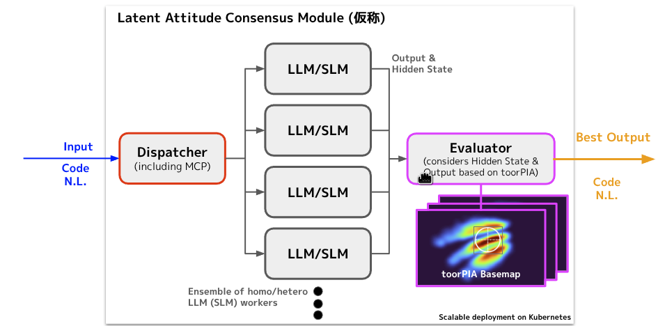

# LLM信頼性の根本的課題：単純タスクでの出力不安定性の実証研究

## 研究概要

本研究では、極めて単純なタスク（色名指定）において、最先端のLarge Language Model (LLM) が示す出力の不安定性を実証的に検証しました。microsoft/Phi-4-mini-instruct (3.8Bパラメータ) を用いた色生成実験により、**従来「高性能」とされるLLMが、基本的なタスクでも10-20%の失敗率を示す**という重大な発見を得ました。

## 検証仮説と実験結果

### 研究仮説
**「単純なタスクでもLLMの出力は不安定である」**

### 実証結果
この仮説は**完全に立証**されました：

| 実験 | タスク | 期待出力 | 成功率 | 失敗の性質 |
|-----|--------|----------|--------|------------|
| **赤色生成** | "Generate red color" | `rgb.py 255 0 0` | **90%** | 出力制御失敗（会話継続） |
| **紫色生成** | "Generate purple color" | `rgb.py 128 0 128` | **80%** | 色認識誤り + 出力制御失敗 |

**詳細な実験結果:**
- [赤色生成実験の詳細結果](https://github.com/toorpia-labs/local-llm-analysis/blob/main/experiments/color_generation/docs/experiment_results_20250929.md)
- [紫色生成実験の詳細結果](https://github.com/toorpia-labs/local-llm-analysis/blob/main/experiments/color_generation/docs/experiment_results_purple_20250930.md)

## 重要な発見

### 1. 単純タスクでの深刻な不安定性
**最も基本的な色指定でも10-20%の失敗率が存在**

- **原色（赤）**: 10%の不安定性
- **基本色（紫）**: 20%の不安定性
- **結論**: 極めて単純な指定でも信頼性に重大な問題

### 2. 問題の多層構造の発見
LLMの失敗は単一要因ではなく、**複数の独立した問題層**で構成：

#### 第1層: 出力制御問題
- **現象**: 正しいコマンド生成後の会話継続
- **発生率**: 赤色10% → 紫色5%（改善傾向）

#### 第2層: 認知・変換問題
- **現象**: 色名の誤認識・誤変換
- **発生率**: 赤色0% → 紫色15%（複雑化で出現）
- **具体例**: Purple → Magenta (128,0,128 → 255,0,255)

### 3. 複雑性と信頼性の逆相関
**タスク複雑度の増加に伴う指数的な信頼性低下**
- 自明な色（赤）でも90%の限界
- 中程度の色（紫）では80%まで低下
- より複雑なタスクでのさらなる悪化が予想される

## 産業応用への深刻な影響

### 実用システムでの致命的ギャップ
**現実のLLM性能と産業要求の100倍の乖離**

- **産業標準**: 99.9%以上の信頼性
- **実測性能**: 80-90%
- **信頼性ギャップ**: 約100倍の差異

この結果は、現在のLLM技術が実用レベルに達していないことを明確に示しています。

### AI安全性への根本的警鐘
**「高性能AI」への盲目的信頼が招く潜在的リスク**

- 医療・金融・製造・交通等の重要分野での誤動作
- 単純タスクでの失敗が複雑システム全体に波及
- 人間の過信による危険な自動化の進行

## 解決すべき技術課題

### 根本的問題の認識
**本実験の80-90%という結果は「優秀な性能」ではなく、解決すべき重大な技術的欠陥**

従来のプロンプトエンジニアリングやパラメータ調整では限界があり、より根本的なアプローチが必要です。

### 技術的解決方向：Hidden State解析による出力最適化

本研究では、**Latent Attitude Consensus Module**による革新的解決策を追求しています：

*図: LLM (SLM) のHidden State可視化による出力の最適化イメージ*

#### アプローチの特徴
1. **Hidden State可視化**: 複数LLMの内部表現を分析
2. **コンセンサスメカニズム**: 最適出力の集合的決定
3. **toorPIA Basemap**: 潜在空間での品質評価
4. **動的最適化**: リアルタイムでの出力品質向上

#### 期待される効果
- **確定的出力制御**: 確率的生成の制御
- **多層問題の統合解決**: 出力制御と認知精度の同時改善
- **産業レベル信頼性**: 99.9%+精度の実現可能性

## 学術的・社会的意義

### 研究パラダイムの転換
1. **LLM信頼性研究の新基準**: 単純タスクでの完璧性要求
2. **AI安全性の新視点**: 基礎的機能の信頼性が全体を規定
3. **評価手法の革新**: 厳密な成功判定基準の確立

### 社会への貢献
1. **AI技術の正しい理解促進**: 過信防止と適切な活用指針
2. **産業標準の見直し**: LLM導入における品質基準策定
3. **次世代AI研究の基盤**: 確定的制御技術への道筋

## 研究の将来展望

### 短期目標：基礎技術の確立
- Hidden State解析手法の開発
- 出力制御機構の実装
- 単純タスクでの100%精度達成

### 中期目標：技術の拡張と検証
- 多色・多タスクでの体系的検証
- Latent Attitude Consensus Moduleの実用化
- 産業応用プロトタイプの開発

### 長期ビジョン：AI信頼性革命
- **確定的AI技術の実現**: LLMの確率的限界の克服
- **産業標準の達成**: 99.9%+信頼性の保証
- **安全なAI社会の構築**: 人間-AI協調の新パラダイム

## 結論

**本研究は、現在のAI技術に対する根本的な見直しを迫る重要な発見を提供しました。**

極めて単純な色指定タスクでの10-20%失敗率は、LLMの「高性能」という一般認識が実用現実と大きく乖離していることを実証しています。しかし、**この課題は技術的限界ではなく、Hidden State解析による新たな解決アプローチで克服可能**です。

**単純タスクでの完璧性確保が、信頼できるAIシステム構築の基盤となる**—この原則に基づいた革新的研究により、真に実用的で安全なAI技術の実現が可能になります。

本研究の成果は、AI安全性確立と次世代AI研究の発展に向けた重要な第一歩として、学術界・産業界に新たな研究方向性を提示するものです。

---

*本研究の詳細な実験データと実装コードは [GitHub リポジトリ](https://github.com/toorpia-labs/local-llm-analysis) で公開されています。完全な実験方法論と結果分析については、[赤色実験](https://github.com/toorpia-labs/local-llm-analysis/blob/main/experiments/color_generation/docs/experiment_results_20250929.md)および[紫色実験](https://github.com/toorpia-labs/local-llm-analysis/blob/main/experiments/color_generation/docs/experiment_results_purple_20250930.md)の詳細ドキュメントをご参照ください。*